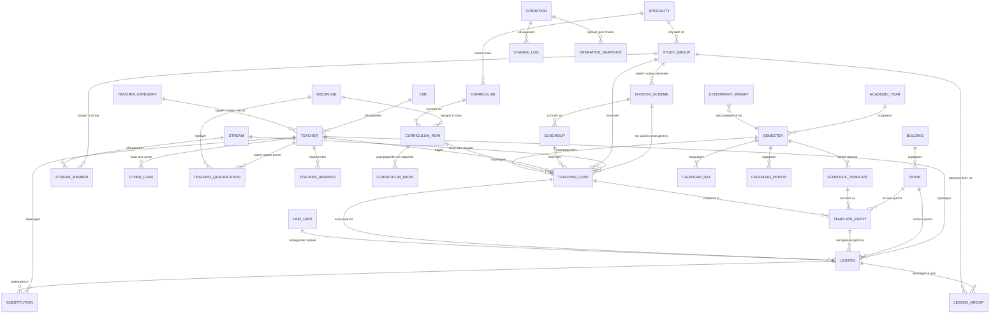

# PLAN.md — Система «Учебный план и расписание медицинского колледжа»

## Context

Медицинский колледж в Кыргызской Республике: шесть специальностей — Сестринское дело,
Лечебное дело, Акушерское дело, Лабораторная диагностика, Зубной техник и Фармация,
обучение по **кредитной системе** — 180 кредитов за 6 семестров по 18 недель, 1 кредит = 30 часов. Учебные планы
согласуются с Минздравом КР. Финансирование делится на бюджетное и контрактное отделения
с раздельным учётом часов.

В колледже нет инструмента, который связывает учебный план, нагрузку преподавателей
и расписание в одну согласованную картину. Расписание составляется вручную, конфликты
(двойное занятие преподавателя, переполненный кабинет, недовыполненная нагрузка)
обнаруживаются постфактум. Нужен офлайн-инструмент под Windows 11 для одного завуча,
который хранит все справочники, генерирует расписание с учётом жёстких ограничений,
позволяет править его руками и печатать готовые формы — при этом корректно переживает
изменения данных в течение года (увольнения, праздники, переносы, правки плана),
не переписывая задним числом уже проведённые занятия.

---

## Цель и границы

**Мы делаем генератор расписания.** Всё остальное существует, чтобы он мог работать.

Ядро системы — сетка **36 слотов** (6 дней × 6 пар) и расстановка в неё занятий
десятков групп, разделённых на пересекающиеся подгруппы, с учётом жёстких ограничений
по преподавателям, кабинетам и студентам, плюс ручная правка перетаскиванием.

Порядок приоритетов, если придётся чем-то жертвовать:

| Приоритет | Что | Почему |
|---|---|---|
| 1 | Сетка расписания, проверка конфликтов, ручная правка | Ради этого всё затевается; без этого система бесполезна |
| 2 | Солвер: автоматическая расстановка | Главная экономия времени завуча |
| 3 | Справочники, учебный план, нагрузка | Исходные данные для сетки — без них солверу нечего расставлять |
| 4 | Печать и экспорт | Расписание должно попасть на стенд |
| 5 | Импорт из Excel, отчёты, замены | Удобство; при нехватке времени урезается первым |

**Присланные файлы — пример данных, а не спецификация.** `patterns/Лабораторная
диагностика уч.план.xls` и `patterns/Годовая нагрузка 2025-2026 REAL.xlsx` показывают,
какого рода сведения ведёт колледж и какой сложности бывают таблицы. Реальные данные
будут вводиться вручную либо приходить другим xlsx неизвестного формата. Из образцов
взято знание о предметной области (§4.8), но не формат импорта: мастер импорта
универсальный, а ручной ввод — равноправный путь.

Чего система **не** делает: не ведёт студентов поимённо, не хранит оценки и журнал,
не считает зарплату, не работает через интернет, не делает расписание экзаменационной
сессии.

---

## 1. Вопросы

### 1.1. Уже отвечено (зафиксировано в плане)

| # | Вопрос | Ответ | Как учтено |
|---|--------|-------|-----------|
| 1 | Модель недели | **Типовая неделя**, но в начале семестра она часто меняется, пока не «устаканится» | Шаблон недели с **версиями** и датой вступления в силу + материализация в конкретные даты + журнал раскаток (§4, §5.6) |
| 2 | Сетка занятий | Единая, **Пн–Сб, пары 1..6** = 36 слотов; часть слотов пустует | `pair_grid` — таблица, а не константа в коде; число пар настраивается |
| 3 | Подгруппы | Деление на 2 или 3 — зависит от численности **и от дисциплины**; нарезки разные и **пересекаются по студентам** | Схемы деления (`division_scheme`) + анонимные позиции студентов; конфликт = пересечение диапазонов (§4.6, §5.3) |
| 4 | Сборка | Сначала только macOS, Windows 11 — после первого нестабильного релиза | Этап 0 закрывается на macOS; Windows-специфика вынесена в этап 8 и в риски R1/R2 (§8) |
| 5 | Исходные данные | Импорт нужен в MVP, но **формат реального файла неизвестен** | Этап 3: универсальный мастер сопоставления колонок с профилями, а не парсер под конкретный файл |
| 6 | Сессия | Только форма контроля в учебном плане | Отдельного расписания экзаменов нет; но `lesson.kind` и `calendar_period.kind` заложены на будущее |
| 7 | Объём MVP | Жадный солвер + ручная правка | MVP = этапы 0–5; отжиг и веса мягких ограничений — этап 6 |
| 8 | Лимит пар в день | Не более 6, **зависит от группы** | Поле `max_pairs_per_day` в `study_group`; жёсткое ограничение солвера |
| 9 | Клинические базы | Режим зависит **и от базы, и от дисциплины** | `building.clinical_mode` (`full_day`/`block`/`free`) + переопределение на строке нагрузки |
| 10 | Зазор на дорогу | Не нужен | Время переезда убрано из модели; осталась только группировка занятий на базе в один день (мягкое) |
| 11 | Кабинет | Бывает «определится позже» | `room_id` NULL допустим: это предупреждение при печати, а не жёсткий конфликт |
| 12 | Праздники и переносы | Вводятся вручную | Предзаполненный календарь РФ из поставки исключён; редактор календаря — этап 2 |
| 13 | Состав студентов | Поимённый список не нужен | Студент = анонимная позиция 1..N по списку журнала; ФИО не хранятся вообще |
| 14 | Состав подгруппы | **Непрерывный отрезок списка журнала** | Хранятся границы `pos_from`/`pos_to`, а не произвольный набор — редактор и проверки заметно проще |
| 15 | Изменчивость нарезки | Меняется **между семестрами** | `division_scheme.semester_id` + `valid_from`/`valid_to`; в середине семестра нарезка стабильна |
| 16 | Режим «весь день на базе» | Столько пар, сколько по часам, но **возврата в колледж в этот день нет** | Жёсткое: в дне с `full_day` у этих студентов нет занятий в других зданиях; хвост дня остаётся пустым и не считается окном |
| 17 | Присланные файлы | **Образцы, а не боевые данные** | Реальные данные будут вводиться вручную либо приходить другим xlsx-файлом; образцы используются как источник знаний о предметной области и как тестовый набор для парсера |
| 18 | Численность групп | Контракт — до 30, бюджет — до 25; группы могут объединяться | Предел модели — 64 позиции (§4.6); объединённая группа 30+25=55 укладывается с запасом 9 |
| 19 | Лимит пар в день | 6 у группы; **у преподавателя лимит тоже действует** | `study_group.max_pairs_per_day` (6) и `teacher.max_pairs_per_day` — оба жёсткие |
| 20 | Недельный лимит группы | **45 часов в неделю** (ограничение ФГОС) | Новое жёсткое ограничение: сумма часов недели у группы ≤ 45, проверяется и при вводе нагрузки, и в солвере |
| 21 | Ёмкость клинической базы | Лимита по числу групп нет | Ограничение уровня здания не вводится; остаются вместимость помещений и режим `full_day` |
| 22 | Факт проведения | **Факт = план минус отмены и замены** | Отдельного экрана отметки нет; `lesson.status = 'held'` проставляется автоматически по прошедшей дате |
| 23 | Потоковые лекции | **Да, лекция читается потоку из нескольких групп** | Занятие перестало быть привязанным к одной группе: `stream` + `lesson_group` (§4.7); преподавателю часы считаются один раз |
| 24 | Начало блока на базе | Желательно с первой пары, но не обязательно | Мягкое ограничение `clinical_block_start` с настраиваемым весом |
| 25 | Отчёт по нагрузке | **Только аудиторные часы** | Проверка работ, классное руководство и прочее в системе не ведутся; этап 7 не разрастается |
| 26 | Несколько рабочих мест | Пока неизвестно | Текущий задел (§3.6) сохраняется, отдельных дней на это не тратится |
| 27 | Состав потока | **Только одна специальность** (и один курс) | У всего потока одна строка учебного плана → таблица `load_target` не нужна, `curriculum_row_id` вернулся в `teaching_load` (−1 день) |
| 28 | Печатные бланки | Утверждённых нет, верстать по своему усмотрению | Три формы (группа, преподаватель, сводная) + буфер в этапе 7 на правки по замечаниям завуча |
| 29 | Оформление замен | **Только в расписании**, бумаг не нужно | Ни приказа, ни листа замен на стенд; история замен остаётся в `substitution` и в аудите (−1 день) |
| 30 | Резервные копии | Рядом с БД + напоминание о копии на флешку | Автокопия при запуске и перед опасными операциями, ротация 20 штук, на главном экране — дата последней внешней копии |
| 31 | Образовательная система | **Кыргызская СПО, кредитная**: 180 кредитов, семестры по 18 недель, 1 кредит = 30 ч | Терминология ФГОС РФ (ОГСЭ/ЕН/ПМ/МДК, квалификационный экзамен) из плана убрана; блоки 1–3, циклы СПО1–СПО5, базовая и элективная части |
| 32 | Кредиты и часы | **Хранить оба**, часы первичны для расписания | `curriculum_row.credits` + часы по видам; контроль «кредиты × 30 = всего часов» и «30 кредитов в семестре» |
| 33 | Виды занятий | **Четыре**: теоретические, практические, семинарские, лабораторные + СРС | `lesson_kind` расширен до `theory`/`practice`/`seminar`/`lab`; СРС в сетку не ставится |
| 34 | Бюджет и Контракт | Разные группы, **одно общее расписание** | `study_group.funding`; конфликты считаются по колледжу целиком, отчёты делятся на два раздела |
| 35 | Категории преподавателей | Штат / внештат / почасовики: **разные нормы часов, почасовики редко доступны, нужны контакты и заметки** | `teacher.category` + справочник норм; телефон, место основной работы, заметка о доступности |
| 36 | Прочие часы | «Тест», методические, ИГА — **хранить, но в сетку не ставить** | Таблица `other_load`: входят в годовую нагрузку и отчёт, солвер их не видит |
| 37 | Форма контроля | Достаточно **номера семестра** итогового контроля | Поле `control_form` из схемы убрано; остаётся `control_semester`, как в файле |
| 38 | Семестры и полугодия | **I полугодие = семестры 1, 3, 5**, II = 2, 4, 6 | `plan_semester_no = (курс − 1) × 2 + полугодие`; вычисляется, а не вводится |
| 39 | Нормы часов | Норма **только у штатных** (720 ч на ставку); внештат и почасовики — без нормы | В отчёте недоработка считается только для штатных, остальным показывается факт |
| 40 | Сетка звонков | **Одна на весь колледж**, 6 пар | Реальное время пар пока неизвестно — ставлю заглушку 08:00–09:30 и далее, завуч правит в настройках |
| 41 | Названия групп | Префикс «К» = контракт; далее код специальности, курс, номер группы | Импорт разбирает «КСД-22» → контракт + Сестринское дело + 2 курс + группа 2 |
| 42 | Срок обучения | **Лечебное дело — 7 семестров (3.5 года)**, остальные 6 | `speciality.semesters_total`; формула `(курс − 1) × 2 + полугодие` даёт для ЛД-41 в I полугодии семестр 7 |
| 43 | Расхождения численности | Разная численность одной группы в файле — **ошибки**, показать и спросить | Импорт собирает варианты («17 в 6 строках, 30 в 9») и просит выбрать; молча не берёт ни один |
| 44 | Пороги подгрупп | До 14 — не делим, 15–22 — на две, больше 22 — на три | Только автоподсказка при создании группы, завуч меняет вручную |
| 45 | Специальности | **Шесть**: `СД` Сестринское дело, `ЛД` Лечебное дело, `АД` Акушерское дело, `Л` Лабораторная диагностика, `СО` Зубной техник, `Ф` Фармация | Код в имени группы бывает однобуквенным (`Л-21`) — разбор идёт по справочнику кодов, а не по первым двум буквам |
| 46 | Объём данных | По образцу — **39 групп**: 12 бюджет + 27 контракт | Порядок величин для тестовых наборов и бенчмарка; реальные числа могут отличаться |
| 47 | Роль присланных файлов | Референс, не спецификация | Импорт проектируется **format-agnostic**: любой xlsx → выбор листа → сопоставление колонок → предпросмотр → профиль на будущее. Ручной ввод — равноправный путь, а не запасной |

### 1.2. Открытые вопросы

Блокирующих вопросов не осталось. Одно уточнение желательно закрыть до этапа 5:

1. **[до этапа 5] Время звонков.** Ставлю заглушку: 08:00–09:30, 09:40–11:10 и далее
   с переменами по 10 минут, шесть пар. Правится в настройках за минуту, но лучше
   заложить верное сразу.

Три допущения, которые стоит проверить на первом же прогоне с реальными данными:

- **«45 часов в неделю».** С кредитной системой это число читается иначе: 30 кредитов
  за семестр × 30 часов ÷ 18 недель = 50 часов в неделю **вместе с СРС**, аудиторных
  примерно вдвое меньше. Похоже, 45 — потолок общей нагрузки студента, а не аудиторной.
  Оставлено настраиваемым параметром.
- **Норма 720 часов на ставку** для штатных преподавателей — взято как типовое значение,
  в файлах виден только факт.
- **Пороги деления на подгруппы** (до 14 — не делим, 15–22 — на две, больше 22 — на три)
  выведены из данных нагрузки, а не заданы приказом.

---

## 2. Структура проекта

```
educational-plan/
├─ package.json
├─ electron.vite.config.ts        # сборка main / preload / renderer одной командой
├─ electron-builder.yml           # конфиг NSIS-инсталлятора
├─ drizzle.config.ts              # конфиг Drizzle Kit
├─ tsconfig.json                  # базовый, strict: true
├─ tsconfig.node.json             # main + preload + solver (типы Node/Electron)
├─ tsconfig.web.json              # renderer (типы DOM, БЕЗ типов Node)
├─ tsconfig.solver.json           # solver отдельно: ни Node, ни DOM, ни Electron
├─ drizzle/                       # СГЕНЕРИРОВАННЫЕ миграции .sql + meta/ (в git!)
├─ build/                         # icon.ico, icon.icns, installer-header.bmp, license.txt
├─ resources/                     # шаблоны печатных форм
├─ scripts/
│  ├─ migrate.ts                  # прогон миграций из CLI (для тестов и CI)
│  └─ seed-demo.ts                # генератор демо-колледжа (см. §9.2)
├─ src/
│  ├─ shared/                     # ← НЕ зависит ни от чего: общий словарь проекта
│  │  ├─ domain/                  # enum-ы: DisciplineKind, LessonStatus, ControlForm...
│  │  ├─ ipc/
│  │  │  ├─ contract.ts           # тип IpcContract: канал → {input, output}
│  │  │  └─ schemas.ts            # zod-схемы для каждого канала (валидация с обеих сторон)
│  │  └─ result.ts                # Result<T, AppError> — единый способ вернуть ошибку
│  │
│  ├─ solver/                     # ← ЧИСТЫЙ TypeScript. Никаких import из electron/db/fs
│  │  ├─ model.ts                 # SolverInput / SolverOutput / Assignment / Violation
│  │  ├─ index.ts                 # solve(input, weights, hooks) — единственная точка входа
│  │  ├─ occupancy.ts             # битовые маски занятости (преподаватель/кабинет/группа)
│  │  ├─ hard.ts                  # проверки жёстких ограничений
│  │  ├─ penalty.ts               # функция штрафа по мягким ограничениям
│  │  ├─ greedy.ts                # начальная жадная расстановка
│  │  ├─ localSearch.ts           # hill climbing / имитация отжига (этап 6)
│  │  ├─ validate.ts              # НЕЗАВИСИМЫЙ валидатор решения (см. §9.1)
│  │  └─ rng.ts                   # ГПСЧ с seed — воспроизводимость результата
│  │
│  ├─ main/                       # Electron main process
│  │  ├─ index.ts                 # bootstrap: миграции → окно → IPC
│  │  ├─ window.ts
│  │  ├─ db/
│  │  │  ├─ client.ts             # better-sqlite3 + drizzle, PRAGMA, путь к файлу
│  │  │  ├─ migrate.ts            # прогон миграций + бэкап перед ними
│  │  │  ├─ schema/               # определения таблиц Drizzle (по файлу на домен)
│  │  │  └─ repositories/         # teachers.repo.ts, groups.repo.ts, lessons.repo.ts...
│  │  ├─ services/                # бизнес-логика: curriculum, load, rollout, substitution
│  │  ├─ solver-host/
│  │  │  ├─ manager.ts            # запуск/отмена utilityProcess, маршрутизация прогресса
│  │  │  └─ entry.ts              # ТОЧКА ВХОДА utilityProcess: мост «сообщения ↔ solve()»
│  │  ├─ ipc/                     # регистрация хендлеров по контракту
│  │  ├─ backup/                  # VACUUM INTO, ротация, восстановление
│  │  ├─ export/                  # excel.ts (ExcelJS), pdf.ts (printToPDF)
│  │  ├─ import/                  # excel-parse.ts, mapping.ts
│  │  └─ audit/                   # запись change_log и operation
│  │
│  ├─ preload/
│  │  └─ index.ts                 # contextBridge.exposeInMainWorld('api', ...)
│  │
│  └─ renderer/
│     ├─ index.html
│     └─ src/
│        ├─ main.tsx
│        ├─ api/                  # типизированная обёртка над window.api
│        ├─ app/                  # роутер, layout, тема, локаль
│        ├─ features/
│        │  ├─ teachers/ groups/ disciplines/ rooms/ calendar/
│        │  ├─ curriculum/ load/
│        │  ├─ schedule-grid/     # сетка dnd-kit, конфликты, панель нераспределённых
│        │  ├─ generation/        # запуск солвера, прогресс, отчёт, применение
│        │  ├─ substitutions/ reports/ backups/ import/
│        ├─ components/ui/        # таблица, форма, диалог, тост — общие
│        └─ print/                # HTML-вёрстка печатных форм + @media print
└─ tests/
   ├─ solver/                     # юнит + бенчмарк + «золотые» наборы
   ├─ db/                         # репозитории и сервисы на временном файле БД
   └─ fixtures/                   # наборы данных (§9.2)
```

### 2.1. Почему так, если ты не работал с Electron

- **main** — обычный Node-процесс. Только он имеет доступ к файлам, БД и ОС.
- **renderer** — это Chromium-вкладка с React. При `nodeIntegration: false` он физически
  не может открыть файл или БД. Это не паранойя, а защита: любой сторонний npm-пакет
  в UI не сможет прочитать диск.
- **preload** — маленький мостик между ними, единственный код, который видит и `window`,
  и Node. Через `contextBridge` он кладёт в `window.api` набор функций, каждая из которых
  под капотом делает `ipcRenderer.invoke('канал', данные)`.
- **utilityProcess** — отдельный процесс, который умеет запускать main для тяжёлых задач.
  Если считать расписание в main, зависнет всё окно (main обслуживает и события UI).
  Поэтому солвер живёт отдельно, шлёт прогресс сообщениями и может быть убит по «Отмена».

### 2.2. npm-скрипты

| Скрипт | Что делает |
|---|---|
| `dev` | `electron-vite dev` — hot reload renderer, перезапуск main при изменениях |
| `typecheck` | `tsc` по всем четырём tsconfig, включая изолированный solver |
| `lint` | ESLint, включая правило запрета импортов в solver (§3.4) |
| `test` | `vitest run` — всё |
| `test:solver` | только `tests/solver` — быстрый цикл при работе над алгоритмом |
| `test:watch` | `vitest` в watch-режиме |
| `bench:solver` | прогон на реалистичном наборе, печатает время и штраф |
| `db:generate` | `drizzle-kit generate` — новая миграция из изменений схемы |
| `db:migrate` | `tsx scripts/migrate.ts` — прогон миграций на файл БД вне Electron |
| `db:studio` | `drizzle-kit studio` — просмотр БД в браузере при разработке |
| `seed:demo` | наполнить БД демо-колледжем |
| `rebuild` | `electron-rebuild -f -w better-sqlite3` — вручную, если что-то сломалось |
| `postinstall` | `electron-builder install-app-deps` — автоматический rebuild после `npm i` |
| `build` | `npm run typecheck && electron-vite build` |
| `build:mac` | `npm run build && electron-builder --mac --dir` (для отладки на этапе 0–7) |
| `build:win` | `npm run build && electron-builder --win --x64` → NSIS `.exe` |

---

## 3. Архитектура приложения

### 3.1. Слои

```
┌───────────────────── renderer (Chromium, React) ─────────────────────┐
│  UI-компоненты → фичи → api/ (типизированный клиент IPC)             │
│  + импорт solver/validate.ts для МГНОВЕННОЙ подсветки конфликтов     │
└───────────────────────────────┬──────────────────────────────────────┘
                                │ window.api.*  (contextBridge)
┌───────────────────────────────▼──────────────────────────────────────┐
│  preload: тонкий мост, только ipcRenderer.invoke / on. Логики нет.   │
└───────────────────────────────┬──────────────────────────────────────┘
                                │ IPC (zod-валидация входа и выхода)
┌───────────────────────────────▼──────────────────────────────────────┐
│  main:  ipc/ (хендлеры)                                              │
│         services/ (бизнес-правила, транзакции, аудит)                │
│         repositories/ (Drizzle-запросы, только они знают SQL)        │
│         db/client (better-sqlite3)                                   │
│         backup/ export/ import/                                      │
│         solver-host/manager ──── fork ────► utilityProcess           │
└──────────────────────────────────────────────┬───────────────────────┘
                                               │ postMessage
                       ┌───────────────────────▼──────────────────────┐
                       │ utilityProcess: entry.ts → solver/solve()    │
                       │ чистые функции, БД не видит                  │
                       └──────────────────────────────────────────────┘
```

Правило: **renderer никогда не формулирует бизнес-правило**. Он не решает, можно ли
поставить занятие — он спрашивает. Единственное исключение — импорт чистого
`solver/validate.ts` для оптимистичной подсветки при перетаскивании; авторитетная
проверка всё равно происходит в main перед записью в БД тем же самым кодом.

### 3.2. IPC-контракт

Контракт — один TypeScript-тип в `shared/ipc/contract.ts`, из которого выводятся
и сигнатуры хендлеров в main, и типы клиента в renderer. Расхождение = ошибка компиляции.

```ts
// shared/ipc/contract.ts (набросок)
export type IpcContract = {
  // справочники — единый CRUD-паттерн
  'teachers:list':      { in: TeacherFilter;   out: Teacher[] };
  'teachers:save':      { in: TeacherInput;    out: Teacher };
  'teachers:archive':   { in: { id: Id; from: IsoDate; reason: string }; out: void };

  // учебный план и нагрузка
  'curriculum:rows':    { in: { curriculumId: Id }; out: CurriculumRow[] };
  'load:list':          { in: { semesterId: Id }; out: TeachingLoad[] };
  'load:balance':       { in: { semesterId: Id }; out: LoadBalanceReport };

  // расписание
  'template:get':       { in: { semesterId: Id; at: IsoDate }; out: TemplateWithEntries };
  'template:move':      { in: MoveEntry; out: { conflicts: Conflict[] } };  // dry-run + запись
  'template:rollout:preview': { in: RolloutRequest; out: RolloutDiff };     // «что изменится»
  'template:rollout:apply':   { in: RolloutRequest; out: { operationId: Id } };
  'schedule:week':      { in: { from: IsoDate; view: 'group'|'teacher'|'room'; id?: Id };
                          out: WeekView };
  'schedule:conflicts': { in: { from: IsoDate; to: IsoDate }; out: Conflict[] };

  // генерация (асинхронная, с прогрессом)
  'generation:start':   { in: GenerationRequest; out: { jobId: string } };
  'generation:cancel':  { in: { jobId: string }; out: void };
  'generation:apply':   { in: { jobId: string }; out: { operationId: Id } };

  // операции, история, откат
  'operations:list':    { in: OperationFilter; out: Operation[] };
  'operations:undo':    { in: { operationId: Id }; out: void };
  'audit:entity':       { in: { entity: string; id: Id }; out: ChangeLogEntry[] };

  // экспорт, бэкапы, импорт
  'export:excel':       { in: ExportRequest; out: { path: string } };
  'export:pdf':         { in: ExportRequest; out: { path: string } };
  'backup:create':      { in: { reason: string }; out: BackupInfo };
  'backup:restore':     { in: { file: string }; out: void };
  'import:preview':     { in: { file: string; kind: ImportKind }; out: ImportPreview };
  'import:apply':       { in: { token: string; mapping: ColumnMapping }; out: ImportResult };
};

// события main → renderer (односторонние)
export type IpcEvents = {
  'generation:progress': { jobId: string; percent: number; bestPenalty: number;
                           placed: number; total: number; phase: 'greedy'|'search' };
  'generation:done':     { jobId: string; result: GenerationSummary };
  'backup:done':         BackupInfo;
};
```

Каждый хендлер обёрнут одинаково: `zod.parse(входа)` → сервис → `Result<T, AppError>`.
Исключения наружу не летят; renderer получает `{ ok: false, error: { code, message, details } }`
и показывает человеческий русский текст по коду ошибки.

### 3.3. Изоляция движка расписания

Солвер получает **снимок** (`SolverInput`) — обычный JSON-совместимый объект. Он не знает
ни про Drizzle, ни про даты в БД, ни про Electron. Ему передаются уже подготовленные
целочисленные индексы (`teacherIdx`, `roomIdx`, `slotIdx`), поэтому его можно:

- вызвать в юнит-тесте под чистым Node за миллисекунды;
- прогнать на сгенерированном наборе без единой строки в БД;
- позже переписать/заменить, не трогая остальное приложение.

Сборка снимка (`services/snapshot.ts`) и обратное применение результата
(`services/apply-solution.ts`) — единственные места, где домен встречается с солвером.

### 3.4. Как эта изоляция удерживается принудительно

1. `tsconfig.solver.json` — без `"types": ["node", "electron"]` и без `"lib": ["DOM"]`.
   Попытка написать `require('fs')` в солвере не скомпилируется.
2. ESLint `no-restricted-imports` для `src/solver/**`: запрет `electron`, `better-sqlite3`,
   `drizzle-orm`, `node:*`, `../main/*`.
3. Тест `tests/solver/isolation.test.ts`: рекурсивно читает импорты `src/solver/**`
   и падает при запрещённом.

### 3.5. Процесс генерации: жизненный цикл

1. Renderer → `generation:start` с параметрами (семестр, диапазон недель, веса, seed).
2. Main собирает снимок из БД (одна транзакция чтения), присваивает `jobId`.
3. Main поднимает `utilityProcess.fork('solver-host/entry.js')` и шлёт снимок.
4. Солвер вызывает `hooks.onProgress()` каждые N итераций/500 мс; хост пересылает в main,
   main — в renderer событием `generation:progress`.
5. «Отмена» → main шлёт `{type:'cancel'}`; солвер проверяет флаг в цикле и возвращает
   лучшее найденное; если не отвечает 3 с — процесс убивается.
6. Результат **не пишется в БД сразу**. Он кладётся в память main как «черновик» и
   показывается пользователю: сколько расставлено, сколько нет, какой штраф,
   что изменится по сравнению с текущим шаблоном.
7. `generation:apply` → одна транзакция: запись версии шаблона + `operation` + `change_log`.

### 3.6. Задел на несколько рабочих мест

Не строим клиент-сервер сейчас, но не закрываем себе дорогу:

- весь доступ к данным идёт через `repositories/` — сменить источник на HTTP-клиент
  можно, не трогая сервисы;
- IPC-контракт по форме — обычный RPC (канал + JSON вход/выход), он переносится в HTTP
  почти дословно;
- в каждой таблице есть `updated_at` и `row_version` (INTEGER, инкремент при записи) —
  готовая основа для оптимистичных блокировок;
- в `change_log` пишется `user` (сейчас всегда «admin», позже — реальный пользователь);
- в БД включён WAL, никакой логики «последний писатель побеждает» в UI нет —
  сохранение всегда проверяет `row_version`.

---

## 4. Схема базы данных

### 4.1. Принципы

- **Историчность вместо удаления.** Связи и «мягкие» сущности имеют `valid_from` / `valid_to`
  (`NULL` = действует бессрочно). Удаление из UI = проставление `valid_to`. Физический DELETE
  запрещён везде, где на строку могут ссылаться занятия. Все внешние ключи —
  `ON DELETE RESTRICT`.
- **Календарные даты** хранятся как `TEXT` в формате `YYYY-MM-DD` (SQLite не имеет типа даты;
  ISO-строка корректно сортируется и сравнивается). Метки времени — `TEXT` ISO-8601 UTC.
- **Часы** — целые (академические часы). Никаких `REAL` для часов.
- **Все изменения** проходят через `change_log`; массовые — ещё и через `operation`
  с сохранением снимка для отката.
- `PRAGMA foreign_keys = ON`, `journal_mode = WAL`, `busy_timeout = 5000`,
  `synchronous = FULL` (данные ценнее скорости).

### 4.2. ER-диаграмма (Mermaid)



### 4.3. Таблицы

**Справочники организации**

| Таблица | Ключевые поля |
|---|---|
| `speciality` | `id`, `code` (`СД`, `ЛД`, `АД`, `Л`, `СО`, `Ф` — от одной до трёх букв), `name`, `qualification`, **`semesters_total`** (6 у большинства, **7 у Лечебного дела**), `archived_at` — в файлах колледжа это «отделение». Код используется при разборе имени группы |
| `cmc` | `id`, `name` (ЦМК), `head_teacher_id` |
| `building` | `id`, `name`, `address`, `is_clinical` (0/1), `clinical_mode` (`full_day`/`block`/`free`) — режим по умолчанию для базы |
| `room` | `id`, `building_id`, `number`, `name`, `capacity` INT, `room_type` (`lecture`/`practice`/`seminar`/`lab`/`phantom`/`computer`/`gym`), `pinned_teacher_id` NULL, `valid_from`, `valid_to` |
| `pair_grid` | `pair_no` PK (1..6), `starts_at` («08:00»), `ends_at` («09:30»), `academic_hours` (2), `enabled` 0/1 — одна сетка на весь колледж, время правится в настройках |

**Люди и группы**

| Таблица | Ключевые поля |
|---|---|
| `teacher` | `id`, `last_name`, `first_name`, `middle_name`, `cmc_id`, **`category_id`** (штат / внештат / почасовик), `rate` REAL, `max_hours_year` INT NULL (NULL = берётся из категории), `max_pairs_per_day` INT, `phone`, `main_workplace` («Роддом, реанимация», «КГМА-2021»), `availability_note` («Нельзя», «Свободна»), `hired_at`, `fired_at` NULL, `note` |
| `teacher_category` | `id`, `code` (`staff`/`external`/`hourly`), `title_ru` («Штат», «Внештат», «Почасовик»), `norm_hours_year` INT NULL — **заполнена только у штатных** (720 на ставку); у внештатных и почасовиков нормы нет, отчёт показывает им факт без недоработки |
| `teacher_qualification` | `id`, `teacher_id`, `discipline_id`, `valid_from`, `valid_to` — **историчная связь** |
| `teacher_absence` | `id`, `teacher_id`, `kind` (`hard` = нельзя ставить / `soft` = нежелательно), `scope` (`weekday` или `date_range`), `day_of_week` NULL, `date_from` NULL, `date_to` NULL, `pair_from`, `pair_to`, `weight` INT, `reason` |
| `study_group` | `id`, `name` («31 СД»), `speciality_id`, `admission_year`, `course`, `students_count`, **`max_pairs_per_day`** INT (по умолчанию 6), **`max_hours_per_week`** INT (по умолчанию 45), `funding` (`budget`/`contract`), `valid_from`, `valid_to`, `merged_into_id` NULL |
| `division_scheme` | `id`, `group_id`, `semester_id`, `name` («на 2 — языки», «на 3 — клинические»), `parts_count` (2/3), `is_default` 0/1, `valid_from`, `valid_to` — **схема нарезки группы, своя на каждый семестр** |
| `subgroup` | `id`, `group_id`, `scheme_id`, `no` (1..3), `pos_from` INT, `pos_to` INT — границы отрезка списка журнала, `students_count` (вычисляется как `pos_to − pos_from + 1`), `valid_from`, `valid_to` |

**Дисциплины и план**

| Таблица | Ключевые поля |
|---|---|
| `discipline` | `id`, `name`, `index_code` («Б1», «Э2», «Б2», «Б3»), **`block`** (1/2/3), **`cycle`** (`spo1` общегуманитарный / `spo2` естественнонаучный / `spo3` профессиональный / `spo4` практики / `spo5` ИГА), **`part`** (`base`/`elective`), `difficulty` INT 1..5, `default_room_type`, `requires_clinical` 0/1, `archived_at` |
| `curriculum` | `id`, `speciality_id`, `admission_year`, `name`, `status` (`draft`/`approved`/`archived`), `approved_at`, `approved_by` |
| `curriculum_row` | `id`, `curriculum_id`, `discipline_id`, `course` (1..4), `semester_no` (1..7), **`credits`** INT, `hours_total` INT, `hours_classroom` INT, **`hours_theory`, `hours_practice`, `hours_seminar`, `hours_lab`**, **`hours_srs`** (самостоятельная работа), **`control_semester`** INT (столбец «Итог. контр.» — номер семестра итогового контроля), `valid_from`, `valid_to`, `supersedes_id` NULL — **правка плана = новая строка, старая закрывается** |
| `curriculum_week` | `id`, `curriculum_row_id`, `week_no`, `hours` — распределение по неделям (необязательное; при отсутствии считается равномерным) |

**Нагрузка — вход солвера**

| Таблица | Ключевые поля |
|---|---|
| `stream` | `id`, `semester_id`, `name` («Поток 1 курс СД+ЛД»), `valid_from`, `valid_to` — объединение групп для лекций |
| `stream_member` | `id`, `stream_id`, `group_id`, `valid_from`, `valid_to` |
| `teaching_load` | `id`, `semester_id`, `curriculum_row_id`, `teacher_id`, **`group_id` NULL, `stream_id` NULL** (задано ровно одно из двух), `division_scheme_id` NULL (NULL = вся группа), `subgroup_id` NULL, `lesson_kind` (`theory`/`practice`/`seminar`/`lab`), `hours_planned` INT — **часы преподавателя, считаются один раз**, `requires_parallel` 0/1, `paired_load_id` NULL, `room_type_required` NULL, `room_id_fixed` NULL, `building_id_required` NULL, `clinical_mode_override` NULL, `valid_from`, `valid_to`, `note` |

`teaching_load` — центральная сущность. Именно она отвечает на вопрос
«что нужно расставить в расписание». Всё остальное — ограничения на неё.

**Календарь**

| Таблица | Ключевые поля |
|---|---|
| `academic_year` | `id`, `name` («2026/2027»), `starts_on`, `ends_on` |
| `semester` | `id`, `academic_year_id`, `no` (1/2 — полугодие учебного года), `starts_on`, `ends_on`, `weeks_count` (18), `status` (`planning`/`active`/`closed`). Номер семестра учебного плана не хранится, а вычисляется: `plan_semester_no = (курс − 1) × 2 + no` — в I полугодии это 1, 3, 5, во II — 2, 4, 6 |
| `calendar_day` | `date` PK, `semester_id` NULL, `kind` (`study`/`weekend`/`holiday`/`vacation`/`moved_workday`), `moved_from_date` NULL, `note` — материализованный календарь на весь год |
| `calendar_period` | `id`, `kind` (`theory`/`practice`/`prequal_practice`/`vacation`/`session`/`iga`/`quarantine`), `course` NULL, `speciality_id` NULL, `group_id` NULL (NULL = для всех), `starts_on`, `ends_on`, `note` — соответствует обозначениям графика учебного процесса: пусто = Т, П, Х, К, «::», ИГА |

**Расписание**

| Таблица | Ключевые поля |
|---|---|
| `schedule_template` | `id`, `semester_id`, `version_no` INT, `effective_from` (дата понедельника), `effective_to` NULL, `status` (`draft`/`active`/`archived`), `based_on_id` NULL, `note`, `created_at`, `created_by` |
| `template_entry` | `id`, `template_id`, `day_of_week` (1..6), `pair_no` (1..6), `teaching_load_id`, `room_id` NULL, `week_parity` (`all`/`odd`/`even`), `is_locked` 0/1 *(закреплено завучем — солвер не двигает)*, `source` (`solver`/`manual`) |
| `lesson` | `id`, `date`, `pair_no`, `teaching_load_id`, `teacher_id`, `room_id` NULL, `discipline_id`, `lesson_kind`, `academic_hours` (2), `template_entry_id` NULL, `template_id` NULL, `status` (`planned`/`held`/`cancelled`/`moved`), `moved_to_lesson_id` NULL, `operation_id`, `note` — **одно занятие = одно событие в сетке**, даже если на нём три группы |
| `lesson_group` | `id`, `lesson_id`, `group_id`, `subgroup_id` NULL, `pos_from`, `pos_to` — кто присутствует на занятии; снимок границ на момент создания |
| `substitution` | `id`, `lesson_id`, `kind` (`teacher_swap`/`room_swap`/`cancel`/`move`), `original_teacher_id`, `substitute_teacher_id` NULL, `original_room_id`, `new_room_id` NULL, `reason`, `document_no`, `created_at`, `created_by` |

`lesson` намеренно денормализована (`teacher_id`, `discipline_id` продублированы
из `teaching_load`, а состав присутствующих зафиксирован в `lesson_group`): занятие — исторический факт, и если завтра нагрузку передадут другому
преподавателю, прошедшее занятие должно продолжать показывать того, кто его реально вёл.
Это и есть механизм «уже проведённые занятия не переписываются задним числом».

**Настройки, история, служебное**

| Таблица | Ключевые поля |
|---|---|
| `constraint_weight` | `id`, `code` (`student_gaps`, `teacher_gaps`, `spread`, `difficulty_early`, `clinical_grouping`, `teacher_preference`, `teacher_days`, `late_pair`, `room_missing`, `clinical_block_start`), `weight` INT, `enabled` 0/1, `semester_id` NULL (NULL = значение по умолчанию), `title_ru`, `description_ru` |
| `operation` | `id`, `kind` (`generate`/`rollout`/`import`/`bulk_edit`/`restore`), `params_json`, `summary_json`, `status` (`preview`/`applied`/`undone`), `started_at`, `finished_at`, `created_by` |
| `operation_snapshot` | `id`, `operation_id`, `table_name`, `row_id`, `before_json` NULL, `after_json` NULL — построчный снимок для отката |
| `change_log` | `id`, `operation_id` NULL, `entity`, `entity_id`, `action` (`create`/`update`/`close`), `before_json`, `after_json`, `at`, `user`, `reason` |
| `backup` | `id`, `file_name`, `created_at`, `reason` (`schedule`/`pre_migration`/`manual`/`pre_restore`), `size_bytes`, `schema_version` |
| `other_load` | `id`, `semester_id`, `teacher_id`, `kind` (`test`/`method`/`iga`/`other`), `hours` INT, `group_id` NULL, `note` — **часы вне сетки расписания**: тестирование, методическая работа, итоговая госаттестация. Входят в годовую нагрузку и отчёты, солвер их не видит |
| `app_setting` | `key` PK, `value_json` |
| `__drizzle_migrations` | служебная таблица Drizzle |

Каждая таблица дополнительно содержит `created_at`, `updated_at`, `row_version` INTEGER.

### 4.4. Индексы и защита от конфликтов на уровне БД

```sql
-- быстрый просмотр недели в любом разрезе
CREATE INDEX idx_lesson_date_pair    ON lesson(date, pair_no);
CREATE INDEX idx_lesson_teacher_date ON lesson(teacher_id, date, pair_no);
CREATE INDEX idx_lesson_room_date    ON lesson(room_id, date, pair_no);
CREATE INDEX idx_lg_group           ON lesson_group(group_id, lesson_id);
CREATE INDEX idx_lg_lesson          ON lesson_group(lesson_id);
CREATE INDEX idx_lesson_load         ON lesson(teaching_load_id);

-- жёсткие ограничения, гарантированные СУБД (частичные уникальные индексы)
CREATE UNIQUE INDEX uq_lesson_teacher ON lesson(teacher_id, date, pair_no)
  WHERE status IN ('planned','held');
CREATE UNIQUE INDEX uq_lesson_room    ON lesson(room_id, date, pair_no)
  WHERE status IN ('planned','held') AND room_id IS NOT NULL;
-- уникального индекса по группе больше нет: занятие потока — одна строка lesson
-- на несколько групп, а подгруппы разных схем пересекаются отрезками, а не номерами.
-- Эта проверка живёт в сервисе (§4.6, §4.7) и покрыта отдельными тестами.

-- историчные связи: не может быть двух пересекающихся периодов
CREATE INDEX idx_qual_teacher ON teacher_qualification(teacher_id, discipline_id, valid_from);
CREATE INDEX idx_load_semester ON teaching_load(semester_id, teacher_id);
```

Уникальный индекс по группе ловит только грубый случай «та же самая подгруппа дважды».
Он принципиально **не может** поймать главный конфликт этой предметной области:
занятие клинической п/гр 1 ({1–10}) и занятие английской п/гр 1 ({1–15}) в одном слоте —
номера подгрупп разные, а студенты 1–10 пересекаются. Такая проверка требует сравнения
диапазонов студентов и делается в сервисе (§4.6). Поскольку подгруппа — непрерывный
отрезок списка, проверка сводится к пересечению интервалов и может быть выражена
прямо в SQL:

```sql
-- есть ли конфликт для нового занятия (:g, :date, :pair, :from, :to)
SELECT 1
  FROM lesson_group lg
  JOIN lesson l ON l.id = lg.lesson_id
 WHERE lg.group_id = :g
   AND l.date = :date AND l.pair_no = :pair
   AND l.status IN ('planned','held')
   AND lg.pos_from <= :to AND lg.pos_to >= :from   -- отрезки пересекаются
 LIMIT 1;
```

Индекс `idx_lg_group` покрывает этот запрос. Уникальные индексы остаются
как дешёвая страховка от программной ошибки; комментарий об этом обязателен в миграции.

### 4.5. Как работает историчность на практике

| Событие | Что происходит |
|---|---|
| Преподаватель уволился 15.10 | `teacher.fired_at = '2026-10-15'`; его `teacher_qualification` закрываются той же датой; `teaching_load` c этой даты закрывается; занятия до 15.10 остаются нетронутыми; занятия после 15.10 попадают в список «требуют переназначения» |
| Дисциплине изменили часы | Создаётся новая `curriculum_row` с `valid_from` = дата изменения, старая получает `valid_to`; пересчёт затрагивает только будущие недели |
| Добавили праздник | `calendar_day.kind = 'holiday'`; занятия этой даты со статусом `planned` → `cancelled`; со статусом `held` не трогаются; предлагается перенос |
| Группы объединили | У поглощённой `study_group.valid_to` и `merged_into_id`; её занятия в прошлом остаются, будущие переносятся операцией `bulk_edit` с возможностью отката |
| Правка типовой недели в начале семестра | Создаётся `schedule_template` версии N+1 с `effective_from` = ближайший понедельник; предыдущая получает `effective_to`; занятия прошлых недель не трогаются |

### 4.6. Подгруппы: пересекающиеся схемы деления

Это самая нетривиальная часть модели, и она вытекает прямо из практики колледжа.

**Задача.** В группе 30 студентов. Клинические дисциплины делят её на 3 подгруппы по 10,
языки — на 2 подгруппы по 15. Это **разные нарезки одних и тех же студентов**.
Если в одном слоте идут клиническая п/гр 1 и английская п/гр 2, занято 10 + 15 = 25
студентов, а 5 человек (позиции 11–15) свободны — нормальная, допускаемая ситуация.
Но клиническая п/гр 1 и английская п/гр 1 в одном слоте — это конфликт:
студенты 1–10 не могут быть в двух местах.

**Решение без ФИО.** Студенты не хранятся поимённо. Хранятся **анонимные позиции**
`1..N` по порядку списка журнала. Подгруппа — непрерывный отрезок этого списка,
то есть пара чисел `pos_from`/`pos_to`. Конфликт занятий — пересечение отрезков:

```
конфликт(A, B) = A.date == B.date
              && A.pair_no == B.pair_no
              && A.group_id == B.group_id
              && A.pos_from <= B.pos_to && A.pos_to >= B.pos_from
```

```
Группа 30 человек, позиции по списку журнала:

           1    5    10   15   20   25   30
           |....|....|....|....|....|....|
на 3:      [ п/гр 1 ][ п/гр 2 ][ п/гр 3 ]      клинические дисциплины
на 2:      [   п/гр 1   ][   п/гр 2   ]        языки
вся группа [==========================]        лекции

клин.п/гр1 [1–10] ∩ англ.п/гр2 [16–30] = ∅  → можно в один слот, 5 чел. свободны
клин.п/гр1 [1–10] ∩ англ.п/гр1 [1–15]  = 10 → конфликт
```

Занятие на всю группу — это просто отрезок `1..N`, поэтому отдельного правила
«лекция vs подгруппа» не нужно: оно вытекает из общего.

**Что это даёт:**

| Свойство | Как получается |
|---|---|
| Персональные данные не хранятся | Позиции анонимны; ФИО нет ни в одной таблице |
| Конфликты считаются точно, а не приблизительно | Пересечение отрезков — операция без допущений |
| Проверка возможна прямо в SQL | Два сравнения на индексированном запросе (§4.4) |
| Три параллельных занятия у одной группы | Работает само: три непересекающихся отрезка |
| «5 свободных студентов» | Не конфликт, но виден в отчёте как недозагрузка |
| Простой редактор | Завуч задаёт число частей, границы считаются сами и правятся мышью |
| Быстро в солвере | Отрезок разворачивается в битовую маску, проверка одной операцией (§5.3) |

**Ограничение по численности:** группы до 64 студентов (маска в два 32-битных слова).
Контрактная группа — до 30 человек, бюджетная — до 25, объединённая 30 + 25 = 55:
запас есть, но небольшой, поэтому проверка на превышение 64 обязательна при вводе группы
и при объединении. Если когда-нибудь понадобится больше — маска расширяется до трёх слов,
меняется только `occupancy.ts`.

**Историчность.** Схема деления привязана к семестру (`division_scheme.semester_id`):
между семестрами нарезка может меняться, внутри семестра она стабильна.
`lesson.pos_from`/`pos_to` — снимок границ на момент создания занятия, поэтому
перекройка нарезки на следующий семестр не искажает прошедшие занятия.

---

### 4.7. Потоковые лекции: одно занятие — несколько групп

Лекция читается потоку («Анатомия — 11 СД, 12 СД, 13 СД, актовый зал»), но в нагрузку
преподавателю эти часы входят **один раз**. Поскольку поток всегда собирается из групп
одной специальности и одного курса, у всех его групп **один и тот же учебный план**,
а значит одна строка `curriculum_row` — и часы списываются с неё однократно.

Поэтому в схеме нужна ровно одна развязка, а не две:

```
teaching_load.stream_id  ─→  stream ──< stream_member    кому читается
lesson  ──< lesson_group                                  кто присутствовал
(одно событие в сетке)
```

| Случай | `teaching_load` | `lesson` | `lesson_group` |
|---|---|---|---|
| Практика у подгруппы | `group_id` + `subgroup_id` | 1 строка | 1 строка |
| Лекция одной группе | `group_id`, подгруппа NULL | 1 строка | 1 строка |
| Лекция потоку из 3 групп | `stream_id`, `group_id` NULL | 1 строка | 3 строки |

**Проверка при создании потока:** все группы одной специальности, одного курса и одного
года набора. Если завуч попробует смешать специальности, приложение это запретит
и объяснит, почему: у групп разные учебные планы, и часы нельзя списать с одной строки.
Если такая потребность когда-нибудь возникнет, решение известно — дочерняя таблица
«кому списываются часы», но сейчас её нет и лишней сложности она не создаёт.

**Почему `lesson` не содержит `group_id`.** Занятие потока — одно событие: один
преподаватель, один кабинет, один слот. Если бы оно хранилось тремя строками, пришлось бы
разрешать «трём занятиям делить одного преподавателя», и уникальные индексы по
преподавателю и кабинету перестали бы работать для всего расписания. Теперь наоборот:
`lesson` строго одна строка на слот, а состав присутствующих вынесен в `lesson_group`.

**Цена решения.** Проверка конфликта по студентам стала запросом с JOIN (§4.4) и не может
быть выражена уникальным индексом. В обмен корректно работают все остальные жёсткие
ограничения, а вместимость кабинета проверяется по сумме групп потока.

---

### 4.8. Что дал разбор присланных образцов

Разобраны два файла: `Лабораторная диагностика уч.план.xls` и
`Годовая нагрузка 2025-2026 REAL.xlsx`. **Это образцы, а не боевые данные:**
реальные сведения будут вводиться вручную либо приходить другим xlsx-файлом
неизвестного пока формата.

Поэтому у разбора две разные роли, и их важно не путать:

| Что вынесено из образцов | Статус |
|---|---|
| Кредитная система, четыре вида часов, СРС, блоки и циклы, шесть специальностей, сроки обучения, категории преподавателей, логика подгрупп, коды групп | **Знание о предметной области.** Подтверждено отдельными вопросами, зафиксировано в схеме §4.3 |
| Конкретные номера колонок, порядок листов, расположение строк «Итого» | **Только тестовый материал.** Импорт под них не затачивается |

Схема §4.3 построена под предметную область, а не под эти файлы. Импорт (этап 3) —
универсальный мастер: любой xlsx → выбор листа → сопоставление колонок → предпросмотр →
сохранение профиля. Разобранные образцы служат первым набором данных для тестов парсера
и наглядным примером того, какой степени сложности файлы встречаются на практике.

Ниже — что именно нашлось в образцах.

**Учебный план, лист «Учебный план»** (102 строки, 17 колонок):

| Колонка файла | Поле схемы | Замечание |
|---|---|---|
| 1 «Б1/Э1/Б2/Б3» | `discipline.index_code` + `part` | Б = базовая часть, Э = элективная |
| 2 «Наименование дисциплин» | `discipline.name` | Одна дисциплина = несколько строк, по одной на семестр |
| 3 «кредит» | `curriculum_row.credits` | |
| 4 «всего часов» | `hours_total` | Инвариант: `credits × 30 = hours_total` |
| 5 «аудиторных» | `hours_classroom` | |
| 6–9 «теор./практ./семин./лабор.» | `hours_theory/practice/seminar/lab` | Четыре вида, а не три |
| 10 «СРС» | `hours_srs` | В расписание не ставится |
| 11 «Итог. контр.» | `control_semester` | Номер семестра итогового контроля, не форма контроля |
| 12–17 «1–6 сем.» | `curriculum_row.semester_no` | Значение в ячейке — **кредиты**, а не часы |
| Строки «Итого:», «ВСЕГО:», «Число экзаменов» | не импортируются | Используются как контрольные суммы при проверке импорта |
| Блоки «Блок 1 / БЛОК2 / БЛОК3», «СПО 1…СПО 5» | `discipline.block`, `discipline.cycle` | Заголовочные строки задают контекст следующим за ними |
| «Физическая культура» со значениями «х» | отдельная строка без кредитов | Обрабатывается как исключение |

**Учебный план, лист «Прил №3 РУП»** — график учебного процесса: строки = курсы I–III,
колонки = недели 1..37+, коды: пусто = теоретическое обучение, `П` = практика,
`Х` = предквалификационная практика, `К` = каникулы, `::` = экзаменационная сессия,
`ИГА` = итоговая госаттестация. Импортируется в `calendar_period` — это готовый источник
учебного календаря на год, вводить его руками не придётся.

**Годовая нагрузка, листы «Бюджет» и «Контракт»** — трёхуровневая иерархия
с пустыми ячейками вместо повторов:

```
Хирургия                                    ← дисциплина, строка-заголовок с итогами
  Жакыпбеков К.Ш.                           ← преподаватель, строка с итогами
    1  СД-21   20 ст.  2 подг.  лек/практ…  ← группа, строка с часами
    2  АД-21   13 ст.  1 подг.  …
```

| Колонка | Поле схемы |
|---|---|
| «Группа» («СД-21», «КЛД-32») | `study_group.name`, разбирается по правилу ниже |
| «Кол-во ст.» | `study_group.students_count` — **сверяется между строками**, расхождения выносятся на разрешение |
| «Подг» | число подгрупп → `division_scheme.parts_count` (§4.6) |
| «Лек.» / «Практ., семин., лаб.» I и II полугодия | `teaching_load.hours_planned` по `lesson_kind` |
| «Тест» | `other_load.kind = 'test'` |
| Суффиксы «ШТ» / «ВНЕШТ» в ФИО | `teacher.category` |
| Правый блок «№ / Ф.И.О. / Предмет / часы» | сводка, не импортируется — контрольная сумма |

**Разбор имени группы.** `[К]` + код специальности + `-` + курс + номер группы на курсе:

```
КСД-22  →  funding = contract, speciality = СД, course = 2, number = 2
ЛД-41   →  funding = budget,   speciality = ЛД, course = 4, number = 1
Л-21    →  funding = budget,   speciality = Л,  course = 2, number = 1
```

Код специальности бывает **однобуквенным**, поэтому разбирать надо по справочнику кодов,
а не «первые две буквы». Всего в файле 39 групп: 12 бюджетных и 27 контрактных.
Справочник кодов:

| Код | Специальность | Семестров | Где встречается |
|---|---|---|---|
| `СД` | Сестринское дело | 6 | бюджет и контракт |
| `ЛД` | Лечебное дело | **7** | бюджет и контракт |
| `АД` | Акушерское дело | 6 | бюджет и контракт |
| `Л` | Лабораторная диагностика | 6 | только бюджет |
| `СО` | Зубной техник | 6 | только контракт |
| `Ф` | Фармация | 6 | только контракт |

Коды выведены из состава дисциплин в нагрузке и подтверждены завучем. Обрати внимание:
на листе «Отделения-Циклы» специальность «Зубной техник» **не указана вообще** —
она видна только по группам `КСО`. Импорт справочника специальностей опирается
на этот список, а не на тот лист.

Курс 4 существует только у Лечебного дела: у него 7 семестров (3.5 года), у остальных
специальностей 6. Номер семестра учебного плана считается как
`(курс − 1) × 2 + полугодие`, поэтому ЛД-41 в первом полугодии — это семестр 7.
Коды специальностей задаются один раз в справочнике; если импорт встретит незнакомый код,
он спросит, а не угадает.

**Расхождения в численности.** В файле одна и та же группа встречается с разным числом
студентов: КЛД-21 — 17, 27 и 30; КСД-31 — 19 и 23. Это ошибки заполнения. Импорт
собирает все варианты с частотой («17 в 6 строках, 30 в 9») и просит выбрать верный,
а не берёт молча первый попавшийся. То же самое с числом подгрупп, если оно
противоречиво в пределах одной дисциплины.

**Прочие листы:** «Отделения-Циклы» → `speciality` и `cmc`; «Категории» → `teacher`
с разделением штат/внештат; «База почасовиков» → `teacher.phone`, `main_workplace`,
`availability_note`; «Посчет кол-ва часов» и «Долг» → отчётность, не импортируются.

**Что это даёт плану.** Не готовый парсер, а понимание, к чему готовиться. Файлы такого
рода: иерархия задана пустыми ячейками вместо повторов, строки «Итого» перемешаны с
данными, на одном листе рядом лежит независимая сводка, одна и та же группа записана
с разной численностью. Значит мастер импорта обязан уметь три вещи, и они заложены в этап 3:

1. **Наследование контекста** — «пустая ячейка = то же, что строкой выше», включаемое
   для выбранных колонок.
2. **Фильтр служебных строк** — правило «строки с текстом Итого/ВСЕГО не данные,
   а контрольные суммы» и сверка с ними по окончании импорта.
3. **Разрешение расхождений** — если один объект пришёл с разными значениями,
   показать варианты с частотой и спросить, а не взять первый попавшийся.

Эти три механизма не зависят от того, придёт ли тот же файл или другой.

---

## 5. Подход к алгоритму расписания

### 5.1. Что именно решает солвер

Не «весь год», а **одну типовую неделю для семестра** (ответ №1: неделя типовая).
36 слотов: 6 дней × 6 пар (часть слотов у большинства групп остаётся пустой —
лимит пар в день задаётся на каждой группе отдельно). Результат — набор `template_entry`,
который затем раскатывается на конкретные даты.

### 5.2. Из часов в занятия

```
академический час = 45 мин, пара = 2 ак. часа
lessonsTotal   = ceil(hours_planned / 2)
lessonsPerWeek = lessonsTotal / weeksCount
```

Если `lessonsPerWeek` не целое (например, 51 ч → 26 пар за 17 недель = 1.53),
берётся `base = floor(1.53) = 1` пара каждую неделю плюс `rest = 26 − 17 = 9`
«дополнительных» пар. Они распределяются по неделям равномерно (алгоритм Брезенхэма)
и выражаются в шаблоне через `week_parity` (`odd`/`even`), а неровный остаток
добирается разовыми занятиями при материализации. Это ровно та ситуация, где
«типовая неделя» протекает — механизм должен быть явным, а не спрятанным.

### 5.3. Структура данных решения

```ts
const DAYS = 6, PAIRS = 6, SLOTS = 36;
const slotIdx = (day - 1) * PAIRS + (pair - 1);

// 36 слотов не помещаются в один 32-битный integer, поэтому любая маска — два слова:
// [0] = слоты 0..31, [1] = слоты 32..35
type SlotMask = readonly [number, number];

interface SolverInput {
  units:    Unit[];          // атом расстановки: одна пара, которую надо разместить
  teachers: TeacherInfo[];   // idx, доступность как SlotMask, maxPairsPerDay
  rooms:    RoomInfo[];      // idx, capacity, type, buildingIdx, clinicalMode
  groups:   GroupInfo[];     // idx, studentsCount, maxPairsPerDay
  slots:    SlotInfo[];      // разрешён ли слот вообще (суббота может быть короче)
  fixed:    Assignment[];    // is_locked = 1 — не двигать
  weights:  Weights;
  limits:   { timeBudgetMs: number; maxIterations: number; seed: number };
}

interface Unit {
  id: number; loadIdx: number;
  teacherIdx: number;
  // ← кто присутствует: одна запись для обычного занятия, несколько для потока
  attendees: ReadonlyArray<{
    groupIdx: number;
    memberMask: readonly [number, number];  // позиции студентов (отрезок pos_from..pos_to)
  }>;
  disciplineIdx: number; difficulty: number;
  roomTypeRequired: RoomType | null; roomIdFixed: number | null;
  roomOptional: boolean;                  // «кабинет определится позже» — можно без него
  clinicalMode: 'full_day' | 'block' | 'free' | null;
  students: number;
  parity: 'all' | 'odd' | 'even';
  pairedUnitId: number | null;            // должен идти в тот же слот
}

// состояние решения
type Solution = {
  slotOf:  Int8Array;    // unitId → slotIdx (-1 = не размещено)
  roomOf:  Int16Array;   // unitId → roomIdx (-1 = без кабинета)

  teacherBusy: Uint32Array;  // 2 слова на преподавателя
  roomBusy:    Uint32Array;  // 2 слова на кабинет
  studentBusy: Uint32Array;  // 2 слова на пару (группа, слот) — маска занятых студентов

  pairsPerDayG: Uint8Array;  // [groupIdx * DAYS + day]   — для лимита пар у группы
  pairsPerDayT: Uint8Array;  // [teacherIdx * DAYS + day] — для лимита у преподавателя
  clinicalDay:  Uint8Array;  // [groupIdx * DAYS + day]   — режим базы, занявшей день
};
```

**Ключевая проверка — занятость студентов, а не подгруппы.** Из-за пересекающихся
нарезок (§4.6) «группа занята» — это неверная постановка. Правильная:

```ts
let free = true;
for (const a of unit.attendees) {            // 1 итерация обычно, 2–4 для потока
  const base = (a.groupIdx * SLOTS + slot) * 2;
  if ((studentBusy[base]     & a.memberMask[0]) !== 0 ||
      (studentBusy[base + 1] & a.memberMask[1]) !== 0) { free = false; break; }
}
```

Две машинные операции И и сравнение на каждую группу-участницу. Занять слот — два ИЛИ. Освободить — два И-НЕ.
Память: 60 групп × 36 слотов × 2 слова × 4 байта ≈ 17 КБ. Проверка занятости
преподавателя и кабинета — так же, но по маске слотов, а не студентов.

Именно поэтому позиции студентов ограничены 64: всё влезает в две 32-битные ячейки
и обходится без BigInt, который на порядок медленнее.

### 5.4. Жёсткие ограничения

Проверяются при каждой попытке разместить `unit` в `(slot, room)`:

| Ограничение | Проверка |
|---|---|
| Преподаватель не в двух местах | `!(teacherBusy[t] & bit)` |
| **Студенты не в двух местах** | цикл по `unit.attendees`: `!(studentBusy[g][slot] & memberMask)` — покрывает лекцию всей группы, параллельные подгруппы разных нарезок (§4.6) и поток из нескольких групп (§4.7) |
| Кабинет не занят | `!(roomBusy[r] & bit)`; если `roomOptional` и кабинет не назначен — проверка пропускается |
| Вместимость | `room.capacity >= unit.students` — для потока это **сумма** по всем группам-участницам |
| Тип кабинета | `room.type === unit.roomTypeRequired` (если задан) |
| СРС в сетку не ставится | часы `hours_srs` вообще не порождают `Unit` |
| Квалификация | предпосчитано: `unit` вообще не создаётся, если преподаватель не имеет права вести дисциплину — конфликт ловится ещё при вводе нагрузки |
| Слот разрешён | `slots[S].enabled` |
| Недоступность преподавателя | битовая маска `teacher.unavailable`, вычтенная заранее |
| Лимит пар в день у группы | `pairsPerDayG[g][day] < group.maxPairsPerDay` (до 6, задаётся на группе) |
| Лимит пар в день у преподавателя | аналогично, по `teacher.maxPairsPerDay` |
| **Недельный лимит часов у группы** | `weeklyHours[g] <= group.maxHoursPerWeek` (по умолчанию 45) — считается по позициям студентов, чтобы параллельные подгруппы не удваивали счёт |
| **Режим `full_day` на клинической базе** | занятий столько, сколько требуют часы, но в этот день у тех же студентов **не может быть занятий в других зданиях**: `clinicalDay[g][day]` фиксирует базу, и любой юнит другого здания в этот день отвергается |
| Парные подгруппы | если `pairedUnitId` задан — оба юнита ставятся в один слот атомарно, иначе откат |
| Сумма часов = плану | инвариант входа: `units` порождаются ровно из `hours_planned`; если что-то не размещено, это видно как `unplaced`, а не как тихая потеря часов |

Выходные, праздники, каникулы и практика **не проверяются солвером** — он работает
с абстрактной неделей. Они применяются на этапе материализации (§5.6), где занятие
на нерабочий день просто не создаётся, а часы уходят в «долг» и показываются завучу.

### 5.5. Мягкие ограничения и функция штрафа

```
penalty = Σ w_c × f_c(solution)
```

| Код | Что считается | Единица |
|---|---|---|
| `student_gaps` | число пустых пар **между** первой и последней парой дня у позиции студента (точнее, чем «окно у группы»: при пересекающихся нарезках окна у разных студентов разные). Хвост дня после блока на базе окном не считается | окно |
| `teacher_gaps` | то же для преподавателя | окно |
| `spread` | превышение над 1 занятием одной дисциплины у одной группы в день | лишнее занятие |
| `difficulty_early` | `difficulty × max(0, pair_no − 2)` — сложное позже второй пары | балл |
| `clinical_grouping` | (число разных дней с клин. базой у группы) − (минимально возможное) | лишний день |
| `teacher_preference` | нарушение «мягкой» недоступности преподавателя | нарушение × вес записи |
| `late_pair` | занятие на 5-й и 6-й паре (вес по умолчанию небольшой, можно обнулить) | занятие |
| `clinical_block_start` | блок на клинической базе начинается не с первой пары | пара сдвига |
| `room_missing` | занятие без назначенного кабинета там, где кабинет в принципе нужен | занятие |
| `teacher_days` | число рабочих дней преподавателя сверх минимально необходимого | лишний день |

Веса живут в `constraint_weight`, редактируются в UI ползунками 0..100 с человеческими
подписями («Не любить окна у студентов»). Изменение весов не требует пересборки. Ноль = выключено.
Штраф всегда пересчитывается **инкрементально** (дельта от одного хода), не с нуля.

### 5.6. Стратегия поиска

**Фаза 1 — жадная расстановка (MVP, этап 5).**
Юниты сортируются по «стеснённости» (most-constrained-first):
редкий тип кабинета → мало доступных слотов у преподавателя → больше занятий в неделю →
крупная группа. Для каждого юнита перебираются допустимые `(slot, room)`, выбирается
пара с минимальным приростом штрафа; при равенстве — псевдослучайно по seed.
Если допустимых вариантов нет — юнит уходит в `unplaced` с записанной причиной,
алгоритм продолжает (не падает и не откатывается целиком).

**Фаза 2 — локальный поиск (этап 6).**
Имитация отжига над ходами:
- `move` — перенести юнит в другой допустимый слот;
- `swap` — обменять слоты двух юнитов;
- `rechair` — сменить кабинет, не меняя слот;
- `insert` — попытаться пристроить юнит из `unplaced`, вытеснив другой (ruin & recreate).

Ход, ухудшающий штраф, принимается с вероятностью `exp(−Δ/T)`, температура падает
геометрически. Периодические рестарты из лучшего найденного решения.
Юниты с `is_locked = 1` из ходов исключены.

**Критерий остановки** (любой первый):
- штраф = 0 и `unplaced` пусто;
- исчерпан бюджет времени (по умолчанию 60 с, настраивается);
- N итераций без улучшения (по умолчанию 20 000);
- пользователь нажал «Отмена» (возвращается лучшее найденное).

**Воспроизводимость.** Весь случайный выбор — через `rng.ts` с явным `seed`.
Один и тот же вход и seed дают один и тот же результат. Это делает возможными
регрессионные тесты качества (§9.1) и «повторить с тем же результатом» в UI.

### 5.7. Если полное решение не найдено

Это нормальная ситуация, а не ошибка. Солвер всегда возвращает **частичное** решение:

```ts
interface SolverOutput {
  assignments: Assignment[];
  unplaced: Array<{
    unitId: number;
    reason: 'no_free_slot' | 'no_suitable_room' | 'teacher_unavailable'
          | 'group_day_limit' | 'paired_unit_failed';
    details: { triedSlots: number; blockedBy: BlockReason[] };  // что именно мешало
  }>;
  penalty: number;
  breakdown: Record<string, number>;   // вклад каждого мягкого ограничения
  iterations: number; elapsedMs: number; stoppedBy: StopReason;
}
```

UI показывает панель «Не удалось расставить: N занятий», где для каждого — понятная фраза
по-русски и кнопки-действия:

> **Сестринское дело, гр. 31 СД, п/гр 2 — Основы реаниматологии (практика), 1 пара/нед.**
> Не нашлось кабинета: нужен «фантомный класс» вместимостью ≥ 15,
> все 4 таких кабинета заняты во всех 11 слотах, где свободны и группа, и Иванова Т.П.
> → *Разрешить кабинет другого типа* · *Снять лимит 4 пар в день у группы* ·
>   *Поставить вручную* · *Показать, кто занимает кабинеты*

Ключевое требование: пользователь никогда не видит «не удалось составить расписание».
Он видит конкретный дефицит ресурса и конкретное действие.

### 5.8. Проверка конфликтов в реальном времени

Один и тот же чистый модуль `solver/validate.ts` используется в трёх местах:
1. в renderer при перетаскивании — мгновенная подсветка «сюда нельзя, потому что…»;
2. в main перед записью — авторитетная проверка;
3. в тестах — как независимый арбитр качества решения.

Занятие, поставленное вручную с нарушением мягкого ограничения, **разрешается**
(с жёлтым предупреждением). Нарушение жёсткого — запрещается, с объяснением.

---

## 6. Разбивка на этапы

Оценка — в человеко-днях по 6 часов, для одного разработчика, знающего JavaScript,
но впервые работающего с Electron. В оценки заложено время на чтение документации.

### Этап 0. Каркас: Electron + TypeScript + SQLite + инсталлятор — **5 дней**

Это самый рискованный этап, поэтому он идёт первым и без единой строки бизнес-логики.

| Задача | Готово, когда |
|---|---|
| 0.1 Инициализация: `electron-vite` + React + TS strict, три tsconfig | `npm run dev` открывает окно с надписью «Работает», HMR применяет правку без перезапуска |
| 0.2 `contextIsolation: true`, `nodeIntegration: false`, `sandbox: true`, CSP | В DevTools `window.require` = undefined; попытка `fetch('http://…')` блокируется CSP |
| 0.3 Установка `better-sqlite3` + настройка `@electron/rebuild` через `postinstall` | После `rm -rf node_modules && npm i` приложение стартует; в логе видна версия SQLite. Отдельно зафиксировать в README: `electron-builder install-app-deps` пересобирает модуль под ABI Electron, а не Node — без этого будет `NODE_MODULE_VERSION mismatch` |
| 0.4 `db/client.ts`: путь `app.getPath('userData')/data/college.db`, PRAGMA, Drizzle | При первом запуске файл БД создаётся; повторный запуск переиспользует его |
| 0.5 Drizzle Kit: одна таблица `app_setting`, первая миграция, прогон при старте до открытия окна | `drizzle/0000_*.sql` в git; при старте пустая БД мигрируется; повторный старт миграций не повторяет |
| 0.6 Первый IPC-канал с zod: `settings:get` / `settings:set` | Кнопка в UI пишет значение в SQLite и читает его после перезапуска |
| 0.7 Заготовка `utilityProcess`: форк, «пинг-понг», отмена | Кнопка «Посчитать» запускает процесс, который 5 секунд считает и шлёт прогресс; «Отмена» его останавливает |
| 0.8 `electron-builder.yml`: NSIS-конфиг, `asarUnpack` для `**/*.node`, иконки | `npm run build:mac` даёт запускаемое приложение, где БД работает **из упакованной сборки** (частая точка отказа: в dev работает, в упакованном — нет) |
| 0.9 `build:win` и `electron-builder.yml` под win/x64 написаны и закоммичены | Конфиг готов; фактический прогон — этап 8 |
| 0.10 Vitest настроен, первый тест солвера-заглушки зелёный | `npm test` проходит |

**Результат этапа:** пустое, но упакованное приложение, которое читает и пишет SQLite
из установленной сборки и умеет считать что-то в фоновом процессе.

> **Рекомендация, которую стоит рассмотреть отдельно.** Ты решил тестировать Windows
> после первого релиза. Дешёвая страховка на этом этапе — добавить GitHub Actions job
> `windows-latest`, который просто выполняет `npm ci && npm run build:win` и выкладывает
> `.exe` артефактом (~1 день работы). Он не требует Windows-машины, но ловит проблему
> с нативным модулем в тот же день, когда она появляется, а не через три месяца.
> Если интернета/CI нет — риск остаётся в списке (R1) и закрывается на этапе 8.

### Этап 1. Ядро данных: схема, аудит, бэкапы — **8 дней**

| Задача | Готово, когда |
|---|---|
| 1.1 Все таблицы §4.3 в Drizzle-схеме, миграция сгенерирована | `npm run db:migrate` на пустом файле создаёт полную схему; `drizzle-kit studio` показывает все таблицы |
| 1.2 Индексы и частичные уникальные индексы §4.4 | Тест: вставка второго занятия того же преподавателя в тот же слот падает с ошибкой БД |
| 1.3 Базовый репозиторий: транзакции, `row_version`, `created_at`/`updated_at` | Тест: конкурентное сохранение с устаревшим `row_version` отклоняется |
| 1.4 Слой аудита: `withAudit(tx, entity, action, before, after, reason)` | Любое изменение через репозиторий порождает запись в `change_log`; тест проверяет before/after |
| 1.5 Механизм операций: `operation` + `operation_snapshot` + `undo(operationId)` | Тест: массовое изменение 100 строк, затем откат, состояние БД совпадает побайтово с исходным |
| 1.6 Бэкапы: `VACUUM INTO` в папку рядом с БД при каждом запуске и перед каждой опасной операцией, ротация 20 последних, бэкап перед миграцией | Тест: бэкап создаётся, старые сверх 20 удаляются; при повреждении основного файла восстановление из бэкапа даёт рабочую БД |
| 1.7 Восстановление из бэкапа: закрыть БД → подменить файл → перезапустить | Из UI можно выбрать бэкап и восстановиться; перед восстановлением делается бэкап текущего состояния |
| 1.7a Напоминание о внешней копии | На главном экране видна дата последнего копирования на флешку; если прошло больше недели — заметное предупреждение с кнопкой «Сохранить копию в выбранную папку» |
| 1.8 Расширение IPC-контракта и типизированного клиента | `typecheck` ловит опечатку в имени канала |

**Результат:** база, которая помнит всё, что с ней делали, и умеет откатываться.

### Этап 2. Справочники и UI-каркас — **13 дней**

| Задача | Готово, когда |
|---|---|
| 2.1 Каркас UI: боковое меню, роутинг, общая таблица (сортировка/поиск/пагинация), общая форма, диалоги, тосты, русская локаль | Пустой раздел выглядит и ведёт себя одинаково для всех справочников |
| 2.2 CRUD: специальности, ЦМК, корпуса, кабинеты | Создание/правка/архивация работают; удаление связанной записи блокируется с понятным текстом «Нельзя удалить кабинет 204: он используется в 47 занятиях» |
| 2.3 CRUD преподавателей + квалификации (историчная связь) + недоступность | Можно указать «Иванова не ведёт по средам» и «Петров уволен с 15.10»; при закрытии квалификации предупреждается о затронутой нагрузке |
| 2.4 CRUD групп с периодами действия и лимитом пар в день | Объединение групп проходит как операция с предпросмотром и откатом |
| 2.5 Схемы деления на подгруппы (§4.6): «разделить на 2» / «разделить на 3» с автоматическим расчётом границ и ручной правкой; схема привязана к семестру | У группы из 30 человек заведены две схемы: 3×10 и 2×15; отрезки покрывают 1..N без пропусков и наложений, иначе сохранение блокируется |
| 2.6 Наглядная проверка совместимости подгрупп разных схем | На карточке группы видна полоса позиций и подсказка «клин. п/гр 1 ∩ англ. п/гр 1 = 10 студентов — вместе ставить нельзя» |
| 2.7 CRUD дисциплин: блок (1–3), цикл (СПО1–СПО5), базовая/элективная часть, признак сложности | Дисциплины сгруппированы по блокам и циклам как в учебном плане колледжа; элективные отделены от базовых |
| 2.8 Календарь: учебные годы, семестры, генерация `calendar_day`, праздники, каникулы, периоды практики, переносы — **всё вручную**, без предзаполненного справочника | Календарь года виден сеткой; отметить праздник — один клик; правка дня переводится в операцию с аудитом |
| 2.9 Сетка звонков (`pair_grid`, до 6 пар) редактируется в настройках | Изменение времени пары отражается во всех представлениях |
| 2.10 Просмотр истории изменений любой записи («Кто менял?») | На карточке преподавателя видно: кто, когда, что изменил |

**Результат:** все справочники ведутся, данные защищены от разрушения.

### Этап 3. Учебный план, нагрузка, потоки и импорт из Excel — **15 дней**

| Задача | Готово, когда |
|---|---|
| 3.1 Редактор учебного плана: таблица «дисциплина × семестр × кредиты × часы по четырём видам × СРС» с блоками и циклами | Можно ввести план специальности целиком; строки сумм по циклам и блокам считаются автоматически; контроль «кредиты × 30 = всего часов» и «30 кредитов в семестре» подсвечивает расхождения |
| 3.2 Версионирование строк плана (`supersedes_id`) | Правка часов утверждённого плана создаёт новую версию и показывает «затронуто занятий: N после 12.10» |
| 3.3 Копирование плана с другого года набора | План на новый набор создаётся за один клик и затем правится |
| 3.4 Распределение часов по неделям (`curriculum_week`), по умолчанию равномерно | Видна недельная раскладка; ручная правка сохраняется |
| 3.5 Редактор нагрузки: назначение преподавателя на «дисциплина + группа/подгруппа + вид занятия» | Нельзя назначить преподавателя без квалификации; предупреждение при превышении `max_hours_year` |
| 3.5a Потоки (§4.7): создание потока из групп одной специальности и курса, лекционная нагрузка на поток | Лекция на поток из трёх групп заводится одной строкой нагрузки; часы преподавателю посчитаны один раз; попытка добавить в поток группу другой специальности или курса отклоняется с объяснением; при расформировании потока лекции корректно распадаются на группы |
| 3.6 Выбор схемы деления в строке нагрузки + флаг `requires_parallel` | В строке нагрузки выбирается: вся группа / схема «на 2» / схема «на 3» и конкретная подгруппа; есть галочка «остальные подгруппы занимаются параллельно» |
| 3.6a Режим клинической базы на строке нагрузки | Можно переопределить режим базы для конкретной дисциплины (`full_day` / `block` / `free`) |
| 3.7 Контроль полноты: «сколько часов плана ещё не распределено» | Экран «Баланс нагрузки»: по каждой группе видно, что не роздано; по каждому преподавателю — сколько набрано (часы потока — один раз) |
| 3.7a Проверка недельного лимита 45 часов на группу | При вводе нагрузки видно, что группа выйдет за лимит, ещё до генерации расписания |
| 3.8 **Универсальный мастер импорта** (ExcelJS): файл → лист → область данных → сопоставление колонок → предпросмотр → применение. Ничего не знает про конкретные файлы | Любой xlsx проходит все пять шагов; сопоставление колонок делается мышью; предпросмотр показывает, что именно будет создано, до записи в БД |
| 3.8a Наследование контекста: «пустая ячейка = значение строкой выше» для выбранных колонок | Трёхуровневая иерархия «дисциплина → преподаватель → группы» из образца разбирается корректно; правило включается галочкой, а не зашито в код |
| 3.8b Фильтр служебных строк и сверка по контрольным суммам | Строки «Итого / ВСЕГО» распознаются по настраиваемому правилу и не попадают в данные; по окончании импорта суммы сверяются с ними, расхождение показывается явно |
| 3.8c Разрешение расхождений: один объект пришёл с разными значениями | Экран «Расхождения в файле»: варианты с частотой («17 в 6 строках, 30 в 9»), завуч выбирает верный; без разрешения импорт не применяется |
| 3.8d Профили импорта: сохранение сопоставления колонок под именем | Повторный импорт файла того же вида не требует настройки заново; профиль правится, если формат изменился |
| 3.8e Целевые схемы импорта: учебный план, нагрузка, справочник преподавателей, календарный график | Мастер знает, какие поля нужны каждой сущности, и подсказывает при сопоставлении; сам разбор колонок остаётся настраиваемым |
| 3.9 Импорт как операция с откатом | Неудачный импорт откатывается одной кнопкой |
| 3.9a Учёт прочих часов (`other_load`): тест, методические, ИГА | Часы вне сетки видны в годовой нагрузке преподавателя и в отчёте, но солвер их не получает |
| 3.10 **Быстрый ручной ввод** как равноправный путь: вставка диапазона из буфера в таблицу, копирование плана с прошлого года, шаблоны специальностей, массовое заполнение | Учебный план на 100 строк вводится без импорта за разумное время; вставка из Excel через буфер работает |

> Присланные файлы — образцы. Реальные данные будут вводиться вручную либо приходить
> другим xlsx неизвестного формата, поэтому импорт делается универсальным (задачи 3.8–3.8d),
> а не парсером под конкретный файл. Образцы служат тестом сложности: если мастер
> справляется с ними — с иерархией из пустых ячеек, строками «Итого» вперемешку с данными
> и противоречивой численностью — он справится и с файлом попроще.
> Ручной ввод (задача 3.10) равноправен импорту, а не запасной вариант.

**Результат:** система знает, кто, что, кому и сколько часов должен вычитать.

### Этап 4. Ручное расписание: шаблон недели, drag-and-drop, конфликты — **14 дней**

| Задача | Готово, когда |
|---|---|
| 4.1 Модель шаблона: создание версии, `effective_from`, статусы | Можно создать шаблон v1 на семестр и вторую версию с 3-й недели |
| 4.2 Сетка расписания на dnd-kit: строки = пары 1..6, колонки = Пн..Сб, разрез по группе; в одном слоте помещается несколько занятий разных подгрупп | Занятия видны, перетаскиваются, изменения сохраняются; параллельные подгруппы отображаются в одной ячейке столбиками; занятие потока видно в расписании каждой группы-участницы и при перетаскивании двигается для всех сразу |
| 4.3 Панель нераспределённой нагрузки сбоку | Видно, что из нагрузки ещё не поставлено; элементы перетаскиваются в сетку |
| 4.4 Проверка конфликтов при перетаскивании (`solver/validate.ts` в renderer), включая пересечение составов подгрупп | При наведении на занятый слот подсвечивается красным с текстом «Иванова Т.П. ведёт в это время 32 ЛД» или «пересечение с англ. п/гр 1: 10 студентов» |
| 4.5 Авторитетная валидация в main перед записью | Тест: обход UI через прямой IPC-вызов с конфликтом отклоняется |
| 4.6 Разрезы просмотра: по группе / преподавателю / кабинету, неделя / день | Переключение разреза не перезагружает страницу; данные приходят одним запросом |
| 4.7 Закрепление занятия (`is_locked`) | Закреплённое занятие визуально отличается и не двигается при генерации |
| 4.8 Материализация: раскатка шаблона на диапазон недель с учётом календаря | Шаблон превращается в занятия на конкретные даты; праздники пропускаются; практика пропускается |
| 4.9 Предпросмотр раскатки: «что изменится» | Диалог показывает: добавится N, изменится M, отменится K занятий; список раскрывается; есть «Применить» и «Отмена» |
| 4.10 Раскатка не трогает прошлое | Тест: занятия со статусом `held` и все занятия до даты `effective_from` остаются нетронутыми |
| 4.11 Экран конфликтов на диапазон дат | Список всех текущих конфликтов с переходом к занятию |

**Результат:** этим уже можно пользоваться вместо Excel.

### Этап 5. Жадный солвер + интеграция — **11 дней** → **это MVP**

| Задача | Готово, когда |
|---|---|
| 5.1 `solver/model.ts`: типы входа/выхода, изоляция от всего остального | `tests/solver/isolation.test.ts` зелёный |
| 5.2 `occupancy.ts` — битовые маски (в том числе потоки: несколько групп на одном занятии), `hard.ts` — жёсткие проверки | Юнит-тесты на каждое жёсткое ограничение по отдельности, включая поток и пересекающиеся нарезки |
| 5.3 `greedy.ts` — начальная расстановка | На наборе «просторный колледж» размещается 100 % юнитов |
| 5.4 `validate.ts` — независимый валидатор | Тест: валидатор ловит специально испорченное решение |
| 5.5 `services/snapshot.ts` — сборка входа из БД | Тест: снимок реального демо-колледжа собирается за < 1 с |
| 5.6 `solver-host` в `utilityProcess`: прогресс, отмена | Генерация семестра не подвешивает UI, прогресс идёт, «Отмена» работает за < 1 с |
| 5.7 Экран генерации: параметры, прогресс, результат | Видно «размещено 412 из 430», штраф, время |
| 5.8 Экран «Не удалось разместить» с причинами и действиями (§5.7) | Для каждого нераспределённого занятия есть человеческая причина |
| 5.9 Применение результата как операция с откатом | «Применить» создаёт версию шаблона; «Отменить генерацию» возвращает предыдущую |
| 5.10 Экспорт в Excel: расписание группы, преподавателя, сводное | Файл открывается в Excel, шапка и объединённые ячейки на месте |
| 5.11 Печатные формы HTML + `@media print` + `printToPDF` | PDF расписания группы печатается на A4 без обрезки |

**Готовность MVP:** завуч вводит справочники (частично импортом), составляет нагрузку,
нажимает «Сгенерировать», получает черновик расписания без жёстких конфликтов,
доводит его руками перетаскиванием, раскатывает на семестр и печатает.

**Суммарно до MVP: 0+1+2+3+4+5 = 66 человеко-дней** (≈ 12–13 недель при полной занятости;
реалистично — 4 месяца с учётом уточнений и переделок).

### Этап 6. Оптимизация расписания — **10 дней**

- `penalty.ts`: все семь мягких критериев с инкрементальным пересчётом.
- `localSearch.ts`: имитация отжига, ходы move/swap/rechair/insert, рестарты.
- UI настройки весов: ползунки с русскими подписями, профили («минимум окон»,
  «беречь преподавателей», «компактные дни»), кнопка «вернуть по умолчанию».
- Разбор штрафа в отчёте генерации: «окна у студентов: 34 (вклад 40 %)».
- Бенчмарк и порог качества в CI (§9.1).
- **Готово, когда:** на эталонном наборе штраф после локального поиска
  минимум на 40 % ниже, чем после жадной расстановки, при том же времени 60 с.

### Этап 7. Замены и отчёты — **9 дней**

- Мастер замены: выбрать заболевшего → период → список его занятий → для каждого
  подобрать замену (кандидаты ранжируются: квалификация → свободен → недобор часов)
  или отменить/перенести.
- История замен видна на карточке занятия и преподавателя. Печатных документов
  (приказ, лист замен на стенд) не делаем — замена живёт только в расписании и отчётах.
- Отчёты: выполнение нагрузки (план/факт по преподавателю; **только аудиторные часы**;
  недоработка до нормы считается **только для штатных**, внештатным и почасовикам
  показывается факт; прочие часы из `other_load` учитываются в годовом итоге;
  **факт = запланированные занятия до текущей даты минус отменённые и переданные по замене**,
  отдельной ручной отметки нет; часы потоковой лекции считаются один раз), вычитанные часы
  по дисциплине и группе, загрузка кабинетов (в том числе процент простоя),
  сводное расписание колледжа.
- Все отчёты — с экспортом в Excel и печатью в PDF.
- **Готово, когда:** завуч за 2 минуты закрывает ситуацию «Иванова на больничном неделю».

### Этап 8. Windows-релиз — **5 дней**

- Прогон `npm run build:win` на Windows 11 x64; починка нативного модуля под Windows-ABI.
- Проверка путей (`userData`, обратные слэши), прав на запись, кириллицы в путях.
- Проверка установки, обновления поверх, удаления; работа без прав администратора.
- Инструкция по установке для завуча с **явным описанием SmartScreen**:
  > При первом запуске Windows покажет синее окно «Система Windows защитила ваш компьютер».
  > Это происходит потому, что установщик не подписан цифровым сертификатом
  > (сертификат платный и продлевается ежегодно). Нажмите «Подробнее» →
  > «Выполнить в любом случае». Это безопасно, если файл получен от разработчика.
  С двумя скриншотами.
- Приёмочный прогон на реальных данных колледжа.
- **Готово, когда:** завуч самостоятельно установил `.exe` на свой компьютер по инструкции.

### Этап 9. Дальнейшее (не планируется сейчас)

Расписание экзаменационной сессии; учёт факта проведения занятий; несколько рабочих мест;
мобильный/веб-просмотр расписания для студентов; подписанный сертификат.

---

## 7. Сводка по трудоёмкости

| Этап | Дней | Накопительно |
|---|---:|---:|
| 0. Каркас | 5 | 5 |
| 1. Ядро данных | 8 | 13 |
| 2. Справочники и схемы деления | 13 | 26 |
| 3. План, нагрузка, потоки, импорт | 15 | 41 |
| 4. Ручное расписание | 14 | 55 |
| 5. Жадный солвер → **MVP** | 11 | **66** |
| 6. Оптимизация | 10 | 76 |
| 7. Замены и отчёты | 9 | 85 |
| 8. Windows-релиз | 5 | **90** |

---

## 8. Риски

| # | Риск | Вероятность / влияние | Меры снижения |
|---|---|---|---|
| **R1** | `better-sqlite3` не собирается под Windows-ABI Electron, и это выясняется поздно, потому что Windows тестируется после первого релиза | Средняя / **Критическое** | Зафиксировать точные версии Electron и better-sqlite3 в `package.json` без `^`; проверить наличие готовых prebuild-бинарников под нужный ABI **до** начала этапа 1; заложить в этап 0 конфиг `build:win`; по возможности — CI-job на `windows-latest` (§этап 0, рекомендация). Запасной вариант: `node-sqlite3-wasm` не подходит (требование транзакционной записи на диск), поэтому запасной вариант — только сборка на реальной Windows-машине |
| **R2** | Windows-специфика (пути с кириллицей, права записи, антивирус, блокирующий NSIS) всплывает при первой установке у завуча | Высокая / Среднее | Все пути только через `app.getPath()`, никаких строковых склеек; тест на путь с русскими буквами и пробелами; этап 8 планировать не на день до сдачи |
| **R3** | SmartScreen отпугивает пользователя, установка не доводится до конца | Высокая / Среднее | Инструкция со скриншотами (этап 8); первую установку делать вместе с завучем; при повторяемости — рассмотреть покупку сертификата |
| **R4** | **Формат боевого файла неизвестен** — присланное лишь образцы. Импорт, написанный под них, окажется бесполезен | Высокая / Среднее | Импорт делается универсальным мастером с сопоставлением колонок и профилями (3.8–3.8d), а не парсером под файл. Образцы используются как тест сложности: иерархия из пустых ячеек, строки «Итого» вперемешку с данными, противоречивая численность — файл попроще пройдёт тем более. Набор `import-variants` специально проверяет, что мастер настраивается, а не зашит |
| **R15** | Импорт вообще не понадобится: завуч будет вводить всё руками | Средняя / Низкое | Ручной ввод спроектирован как равноправный путь (задача 3.10): вставка из буфера, копирование плана с прошлого года, шаблоны специальностей. Если импорт не пригодится, потеряны 3–4 дня из 15, а не весь этап |
| **R5** | Данных для качественного расписания не хватает: слишком мало кабинетов нужного типа, слишком жёсткие пожелания преподавателей — солвер физически не может составить расписание | Высокая / Высокое | Не пытаться «дожать» алгоритмом; §5.7 — показывать конкретный дефицит и предлагать действия. Отдельный экран «Диагностика ресурсов» до генерации: «специализированных кабинетов хватает на 82 % практических занятий» |
| **R6** | Расписание сгенерировано, но завуч ему не доверяет и делает по-своему | Средняя / Высокое | Показывать *почему* так расставлено (разбор штрафа); закрепление занятий; результат генерации — всегда черновик, применяется вручную; ранняя демонстрация на реальных данных после этапа 5 |
| **R7** | Пересчёт задним числом ломает историю; завуч теряет данные | Низкая / **Критическое** | Занятия денормализованы и неизменны после `held`; любая массовая операция = предпросмотр + снимок + откат; бэкап перед каждой генерацией и миграцией |
| **R8** | Миграция схемы портит рабочую БД | Низкая / Критическое | Только версионированные миграции Drizzle Kit в git; `VACUUM INTO`-бэкап перед каждой миграцией; миграции прогоняются на копии реальной БД перед выпуском версии |
| **R9** | Производительность UI на сетке с большим числом занятий | Средняя / Низкое | Загружать одну неделю в одном разрезе, а не весь семестр; виртуализация списков; агрегаты считать в SQL, а не в JS |
| **R10** | Незнакомость Electron: оценки этапа 0 и 4 занижены | Средняя / Среднее | Этап 0 намеренно первый и без бизнес-логики; в оценки заложено время на документацию; если этап 0 занял вдвое дольше — пересмотреть весь план, а не догонять |
| **R11** | Единственный пользователь и единственная копия БД: поломка компьютера = потеря всего | Средняя / Критическое | Автобэкап при каждом запуске и по расписанию; в инструкции — обязательное еженедельное копирование на флешку, а приложение само напоминает об этом на главном экране, если копии не было больше недели (задача 1.7a) |
| **R13** | Нарезка на подгруппы окажется не отрезком списка (делят по успеваемости, по языку, по желанию) или её придётся менять в середине семестра | Низкая / Высокое | Переход от `pos_from`/`pos_to` к произвольному набору позиций — это правка одного поля и одной функции пересечения, интерфейс солвера (битовая маска) не меняется вообще. Смена нарезки в середине семестра решается через `valid_from`/`valid_to` и снимок границ в `lesson_group`. Появление потребности в ФИО студентов — отдельный этап, а не правка |
| **R12** | Требования расширяются по ходу (сессия, факт, студенты поимённо) | Высокая / Среднее | Схема БД уже содержит нужные точки расширения (`lesson.status`, `calendar_period.kind`); всё, что не в этапах 0–8, обсуждается как отдельный этап с отдельной оценкой |

---

## 9. План тестирования

### 9.1. Солвер — отдельно от приложения

Солвер тестируется под чистым Node (`vitest`), без Electron и без БД. Это главное
преимущество его изоляции: полный прогон тестов алгоритма занимает секунды.

**Уровень 1 — юнит-тесты жёстких ограничений.** По одному тесту на каждое ограничение
из §5.4, на минимальном входе (1–2 группы, 1–2 преподавателя).

**Уровень 2 — независимый валидатор.** `validate.ts` пишется **отдельно** от `greedy.ts`
и не переиспользует его код: он линейно проходит по решению и заново проверяет каждое
жёсткое ограничение. Инвариант всех тестов: *любое решение, возвращённое солвером,
проходит валидатор без единого жёсткого нарушения*. Если солвер и валидатор написаны
одним и тем же способом, они разделят одну и ту же ошибку — поэтому валидатор намеренно
«тупой и медленный».

**Уровень 3 — property-based (fast-check).** Генерируются случайные корректные входы
(варьируются число групп, кабинетов, плотность нагрузки). Проверяемые свойства:
- решение никогда не нарушает жёсткие ограничения;
- `размещено + не размещено = всего юнитов` (часы не теряются);
- один и тот же seed даёт идентичный результат;
- закреплённые (`is_locked`) юниты остаются на своих местах;
- парные подгруппы либо обе размещены в одном слоте, либо обе не размещены.

**Уровень 4 — регрессия качества.** «Золотые» наборы с зафиксированным seed
и порогом штрафа (`expect(penalty).toBeLessThan(GOLDEN + 5%)`). Ловит ухудшение
алгоритма при рефакторинге.

**Уровень 5 — бенчмарк.** `npm run bench:solver` на полном наборе: 60 групп,
150 преподавателей, 200 дисциплин. Требование: жадная фаза < 3 с, полный цикл
укладывается в заданный бюджет, память < 300 МБ.

### 9.2. Тестовые наборы данных

Все — детерминированные генераторы в `tests/fixtures/`, плюс `npm run seed:demo`
для наполнения реальной БД.

| Набор | Состав | Что проверяет |
|---|---|---|
| `minimal` | 1 группа, 2 преподавателя, 3 дисциплины, 2 кабинета | Базовая корректность, читаемость отладки |
| `roomy` | 20 групп, ресурсов с большим запасом | 100 % размещения, низкий штраф |
| `tight` | 60 групп, кабинетов ровно впритык, узкие окна преподавателей | Работа под давлением; часть в `unplaced` — норма |
| `impossible` | Одна дисциплина требует кабинет, которого нет | Корректная диагностика в `unplaced`, отсутствие зависания |
| `subgroups` | Группа 30 человек с двумя схемами: 3×10 (клинические) и 2×15 (языки); сценарии параллельных и последовательных занятий | Пересечение отрезков (§4.6): клин. п/гр 1 + англ. п/гр 2 ставятся в один слот, клин. п/гр 1 + англ. п/гр 1 отвергаются |
| `clinical` | Треть занятий на трёх базах с разными режимами (`full_day`, `block`, `free`) | Запрет возврата в колледж в день `full_day`; группировка занятий на базе в один день |
| `full-college` | Реалистичный медколледж по образцу настоящего: 6 специальностей (СД, ЛД, АД, Л, СО, Ф), 39 групп (12 бюджет + 27 контракт), ~140 преподавателей трёх категорий | Бенчмарк и приёмка |
| `sample-import` | Присланные образцы — как **тест сложности** мастера импорта, а не как эталон формата | Наследование контекста из пустых ячеек, отсечение строк «Итого» и сверка по ним, разрешение противоречивой численности, разбор кодов групп |
| `import-variants` | Тот же смысловой набор с переставленными колонками, другим порядком листов и другими заголовками | Проверка, что мастер настраивается, а не зашит: импорт проходит через сопоставление колонок без правки кода |
| `streams` | Поток из трёх групп одной специальности; лекция потоку в актовом зале; попытка собрать поток из разных специальностей | Одно занятие занимает студентов всех групп; вместимость проверяется по сумме; часы преподавателю посчитаны один раз; смешанный поток отклоняется |
| `limits` | Группа 55 человек после объединения; группа, упирающаяся в 45 часов в неделю; преподаватель на потолке пар в день | Граничные случаи жёстких ограничений: маска на 64 позиции, недельный лимит, лимит преподавателя |
| `year-changes` | Полный учебный год со сценарием изменений: увольнение в октябре, новый праздник, объединение групп, правка плана в декабре | Историчность (§9.4) |

### 9.3. Слой данных

- Тесты репозиториев и сервисов на временном файле БД (`better-sqlite3` под Node,
  без Electron), каждый тест — своя чистая БД + прогон миграций.
- Тест защиты: попытка удалить используемый кабинет/преподавателя/дисциплину падает.
- Тест уникальных индексов: двойное занятие отклоняется самой СУБД.
- Тест аудита: любое изменение оставляет корректный `change_log`.
- Тест отката: массовая операция → `undo` → БД идентична исходной (сравнение дампов).
- Тест миграций: каждая новая миграция прогоняется на снимке БД предыдущей версии
  с данными, а не только на пустой.

### 9.4. Историчность — отдельный блок тестов

Сценарий `year-changes` прогоняется как последовательность шагов, и после каждого
проверяется, что **прошлое не изменилось**:

1. Составить и раскатать расписание на семестр → снять хеш всех занятий до текущей даты.
2. Уволить преподавателя 15.10 → занятия до 15.10 идентичны; после — в списке
   «требуют переназначения».
3. Добавить праздник 4.11 → занятия 4.11 отменены, остальные не тронуты.
4. Изменить часы дисциплины 1.12 → пересчёт затронул только недели после 1.12.
5. Откатить шаг 4 → состояние совпадает с состоянием после шага 3.

### 9.5. Приложение целиком

- Smoke-тест сборки: запуск упакованного приложения, создание БД, один IPC-вызов.
  Отдельно проверяется, что нативный модуль работает **из asar-сборки**, а не только в dev.
- Playwright для Electron на трёх критичных сценариях: ввод преподавателя,
  перетаскивание занятия, запуск и отмена генерации. Больше e2e не делаем —
  дорого в поддержке и медленно.
- Ручной чек-лист приёмки с завучем (составляется на этапе 5, прогоняется на этапе 8):
  20–25 пунктов от «завести преподавателя» до «распечатать расписание на стенд».

---

## 10. Проверка результата (как понять, что этап сдан)

| Этап | Команда / действие | Ожидаемое |
|---|---|---|
| 0 | `rm -rf node_modules && npm i && npm run dev` | Окно открывается, значение пишется в SQLite и переживает перезапуск |
| 0 | `npm run build:mac`, запуск собранного приложения | БД создаётся в `userData`, нативный модуль работает из asar |
| 1 | `npm test -- tests/db` | Все тесты аудита, отката и бэкапов зелёные |
| 2–3 | `npm run seed:demo`, ручной обход разделов | Справочники и план ведутся, удаление связанного блокируется |
| 5 | `npm run bench:solver` | Жадная фаза < 3 с на `full-college`, 0 жёстких нарушений |
| 5 | В приложении: «Сгенерировать» на демо-колледже | Прогресс идёт, UI отзывчив, «Отмена» срабатывает, результат применяется и откатывается |
| 6 | `npm test -- tests/solver/golden` | Штраф не выше зафиксированного порога |
| 8 | Установка `.exe` на Windows 11 по инструкции | Приложение ставится и работает у завуча без участия разработчика |

---

## 11. Что делать сразу после утверждения плана

1. Сохранить этот документ как `PLAN.md` в корне проекта, `git init`, первый коммит.
2. Запросить у тебя открытые вопросы 1–2 (они нужны раньше всех): значения по умолчанию
   (порог деления на 3, лимит пар) и три Excel-файла — учебный план, тарификация,
   список преподавателей.
3. Начать **этап 0** — и не двигаться дальше, пока пункт 0.8 (работающая SQLite
   в упакованном приложении) не закрыт. Это единственная точка, где проект может
   упереться в непреодолимое препятствие; лучше узнать об этом на пятый день.
